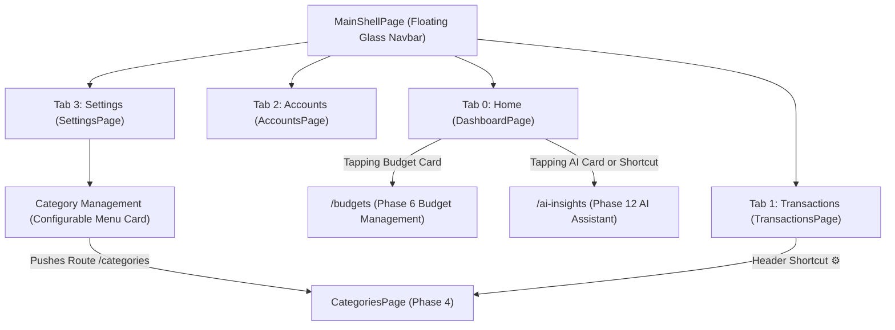

# Implementation Plan: Navigation Flow & Interactive Cards Integration

This document details the complete user-friendly navigation architecture, configurable Category access via Settings, and interactive navigation for **BudgetOverviewCard** (Phase 6) and **AiSummaryCard** (Phase 12) in **Dhanra-New**.

---

## 1. Interactive Cards Integration Strategy

### 📊 `BudgetOverviewCard` (Phase 6 – Budget Management)
- **Current Role**: Prominent card on Home Dashboard displaying real-time spending progress against the monthly budget limit (`spentAmount` vs `totalLimit`).
- **Interactive UX Navigation**:
  - Tapping on `BudgetOverviewCard` navigates to **`/budgets`** ([BudgetPage]).
  - Users can set monthly budget caps, category-specific budget limits (e.g., *Food ₹10,000*, *Shopping ₹15,000*), and over-budget warning thresholds.
- **Real-Time Balance Sync**:
  - Whenever an Expense transaction is added/edited in Phase 5, `budgetSpentAmount` and the `LinearProgressIndicator` on `BudgetOverviewCard` auto-update in real time!

### 🤖 `AiSummaryCard` & `AI Insights` Shortcut (Phase 12 – AI Features)
- **Current Role**: Glassmorphic banner card on Home Dashboard displaying dynamic AI-generated spending insights and savings suggestions.
- **Interactive UX Navigation**:
  - Tapping on `AiSummaryCard` or tapping `AI Insights` in `QuickActionsRow` opens the **AI Financial Assistant Sheet / Screen** ([AiInsightsPage] / `/ai-insights`).
  - Provides deep financial breakdowns, monthly budget forecasting, subscription detection, and smart savings advice based on real-time transaction history.

---

## 2. Revised 4-Tab Bottom Navbar Architecture

---

## 3. Proposed Module Structure

### 1. Settings & Preferences (`lib/features/settings`)
- `lib/features/settings/presentation/pages/settings_page.dart`

### 2. Main Navigation Shell (`lib/core/common_widgets`)
- `lib/core/common_widgets/main_shell_page.dart`

### 3. Home Dashboard & Quick Actions Integration
- `lib/features/dashboard/presentation/pages/dashboard_page.dart`
