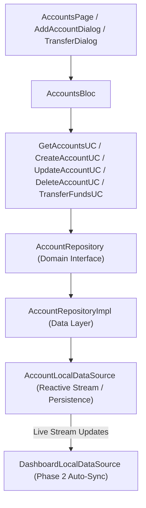

# Implementation Plan: Phase 3 – Accounts Management

This document details the technical architecture, data models, domain use cases, state management (BLoC), and UI components for implementing **Phase 3 (Accounts Management)** in **Dhanra-New**.

---

## Objective & Features

Deliver a production-grade, offline-first **Accounts Management System** featuring:
1. 🏦 **Account Types Supported**:
   - **Bank Account** (e.g. HDFC Bank, ICICI Bank)
   - **Digital Wallet** (e.g. Paytm, PhonePe, Google Pay)
   - **Cash** (Physical cash wallet)
   - **Credit Card** (with Credit Limit & Due Date tracking)
2. ➕ **Create Account**: Form dialog to add accounts with icon, color theme, type, and starting balance.
3. ✏️ **Edit Account**: Update account name, type, color, icon, and balance.
4. 🗑️ **Delete Account**: Safe deletion of unused accounts.
5. 🔄 **Transfer Between Accounts**: Instant fund transfer from Account A -> Account B (updating both balances).
6. 💰 **Net Worth & Accounts Overview**: Net worth card displaying total balance grouped by account type.
7. ⚡ **Dashboard Integration**: Real-time stream integration connecting Phase 3 account balances to the Phase 2 Dashboard Net Balance.

---

## Architecture Diagram

---

## Proposed Module Structure

### Accounts Feature (`lib/features/accounts`)

#### Domain Layer
- `lib/features/accounts/domain/entities/account_entity.dart`
- `lib/features/accounts/domain/repositories/account_repository.dart`
- `lib/features/accounts/domain/usecases/get_accounts_usecase.dart`
- `lib/features/accounts/domain/usecases/create_account_usecase.dart`
- `lib/features/accounts/domain/usecases/update_account_usecase.dart`
- `lib/features/accounts/domain/usecases/delete_account_usecase.dart`
- `lib/features/accounts/domain/usecases/transfer_funds_usecase.dart`

#### Data Layer
- `lib/features/accounts/data/models/account_model.dart`
- `lib/features/accounts/data/datasources/account_local_data_source.dart`
- `lib/features/accounts/data/repositories/account_repository_impl.dart`

#### Presentation Layer (BLoC & UI)
- `lib/features/accounts/presentation/bloc/accounts_event.dart`
- `lib/features/accounts/presentation/bloc/accounts_state.dart`
- `lib/features/accounts/presentation/bloc/accounts_bloc.dart`
- `lib/features/accounts/presentation/widgets/account_card.dart`
- `lib/features/accounts/presentation/widgets/add_edit_account_dialog.dart`
- `lib/features/accounts/presentation/widgets/transfer_funds_dialog.dart`
- `lib/features/accounts/presentation/pages/accounts_page.dart`
