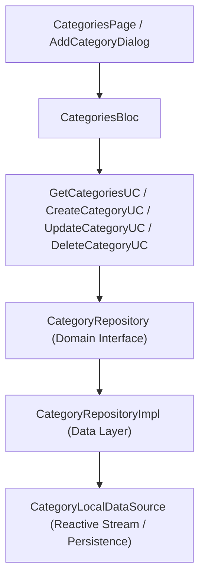

# Implementation Plan: Phase 4 – Categories Management

This document details the technical architecture, data models, domain use cases, state management (BLoC), and UI components for implementing **Phase 4 (Categories Management)** in **Dhanra-New**.

---

## Objective & Features

Deliver a production-grade **Category Management System** supporting both Income & Expense classification:
1. 🏷️ **Income & Expense Classification**:
   - Categorizes spending and earnings into `Expense` vs `Income` buckets.
2. 🔒 **System Defaults & Custom Categories**:
   - Pre-seeded with 10+ default financial categories (`Food & Dining`, `Groceries`, `Shopping`, `Bills & Utilities`, `Transportation`, `Entertainment`, `Salary`, `Freelance`, etc.).
   - Users can create custom categories with custom icons, colors, and types.
   - System default categories are protected from accidental deletion.
3. 🎨 **Rich Icon & Color Palette Picker**:
   - Icon selector grid containing financial & lifestyle icons.
   - Vibrant color palette picker matching Dhanra design system tokens.
4. 🌿 **Sub-Categories Support**:
   - Hierarchical category structure (e.g. `Food & Dining` -> `Restaurants`, `Coffee`).
5. 🔍 **Search & Segmented Filtering**:
   - Real-time search bar to quickly filter categories by name.
   - Segmented tab control (`Expense` | `Income`).

---

## Architecture Diagram

---

## Proposed Module Structure

### Categories Feature (`lib/features/categories`)

#### Domain Layer
- `lib/features/categories/domain/entities/category_entity.dart`
- `lib/features/categories/domain/repositories/category_repository.dart`
- `lib/features/categories/domain/usecases/get_categories_usecase.dart`
- `lib/features/categories/domain/usecases/create_category_usecase.dart`
- `lib/features/categories/domain/usecases/update_category_usecase.dart`
- `lib/features/categories/domain/usecases/delete_category_usecase.dart`

#### Data Layer
- `lib/features/categories/data/models/category_model.dart`
- `lib/features/categories/data/datasources/category_local_data_source.dart`
- `lib/features/categories/data/repositories/category_repository_impl.dart`

#### Presentation Layer (BLoC & UI)
- `lib/features/categories/presentation/bloc/categories_event.dart`
- `lib/features/categories/presentation/bloc/categories_state.dart`
- `lib/features/categories/presentation/bloc/categories_bloc.dart`
- `lib/features/categories/presentation/widgets/category_tile.dart`
- `lib/features/categories/presentation/widgets/add_edit_category_dialog.dart`
- `lib/features/categories/presentation/pages/categories_page.dart`
