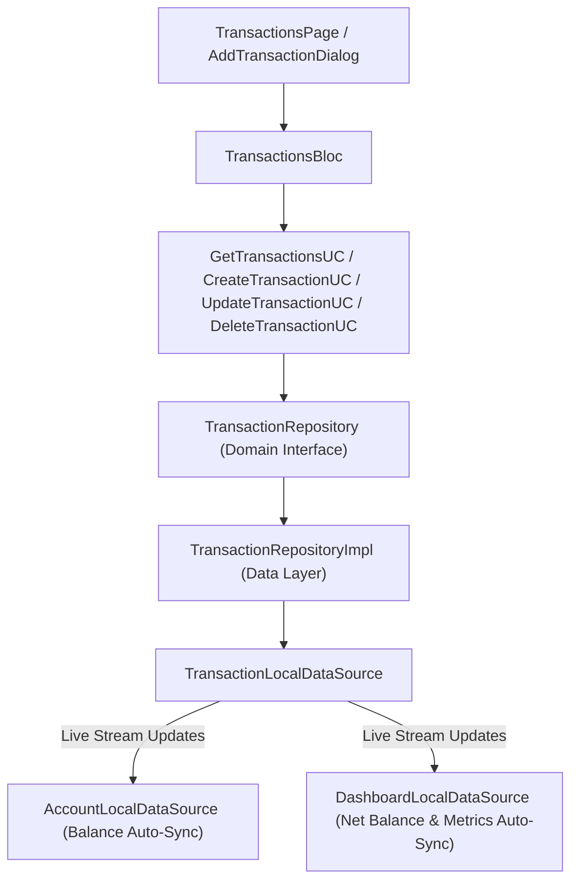

# Implementation Plan: Phase 5 – Transactions Management

This document details the technical architecture, data models, domain use cases, state management (BLoC), and UI components for implementing **Phase 5 (Transactions Management)** in **Dhanra-New**.

---

## Objective & Features

Deliver a production-grade, reactive **Transactions Management System**:
1. 💳 **Transaction Types Supported**:
   - **Expense** (-₹)
   - **Income** (+₹)
   - **Transfer** (Inter-account transfer)
2. 🔄 **Reactive Multi-Layer Balance Sync**:
   - Creating an Expense reduces Account balance and updates Dashboard monthly expense & net balance.
   - Creating an Income increases Account balance and updates Dashboard monthly income & net balance.
   - Editing or deleting transactions automatically recalculates Account balances and Dashboard metrics in real time.
3. 🏷️ **Category & Account Integration**:
   - Seamless integration with Phase 3 Accounts (`accountId`) and Phase 4 Categories (`categoryId`).
4. 📅 **Grouped Transaction Feed & Automatic Date Formatting**:
   - Transactions automatically grouped by Date headers (*Today*, *Yesterday*, *01 Aug 2026*).
   - Displaying 5 initial seed transactions (*Salary Deposit*, *Apple Purchase*, *Starbucks Coffee*, *Supermarket*, *Freelance Design*).
   - Type filter chips (*All*, *Expenses*, *Income*, *Transfers*).
   - Real-time search bar filtering by title or notes.
5. 📸 **Receipt Attachment Support**:
   - Optional receipt image picker field in the Add/Edit Transaction modal.
6. ➕ **Quick Add / Edit Modal**:
   - Glassmorphic bottom sheet for creating/editing transactions.

---

## Architecture Diagram

---

## Proposed Module Structure

### Transactions Feature (`lib/features/transactions`)

#### Domain Layer
- `lib/features/transactions/domain/entities/transaction_entity.dart`
- `lib/features/transactions/domain/repositories/transaction_repository.dart`
- `lib/features/transactions/domain/usecases/get_transactions_usecase.dart`
- `lib/features/transactions/domain/usecases/create_transaction_usecase.dart`
- `lib/features/transactions/domain/usecases/update_transaction_usecase.dart`
- `lib/features/transactions/domain/usecases/delete_transaction_usecase.dart`

#### Data Layer
- `lib/features/transactions/data/models/transaction_model.dart`
- `lib/features/transactions/data/datasources/transaction_local_data_source.dart`
- `lib/features/transactions/data/repositories/transaction_repository_impl.dart`

#### Presentation Layer (BLoC & UI)
- `lib/features/transactions/presentation/bloc/transactions_event.dart`
- `lib/features/transactions/presentation/bloc/transactions_state.dart`
- `lib/features/transactions/presentation/bloc/transactions_bloc.dart`
- `lib/features/transactions/presentation/widgets/transaction_item_card.dart`
- `lib/features/transactions/presentation/widgets/add_edit_transaction_dialog.dart`
- `lib/features/transactions/presentation/pages/transactions_page.dart`
