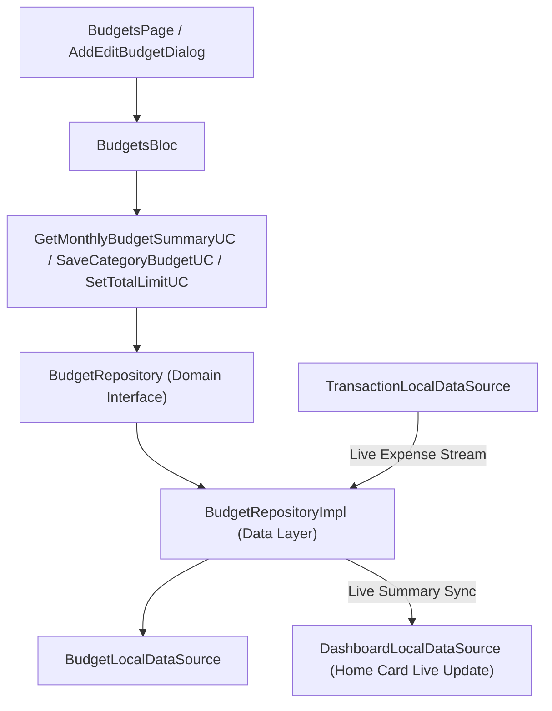

# Implementation Plan: Phase 6 – Budget Management

This document details the technical architecture, data models, domain use cases, state management (BLoC), UI components, and real-time balance sync for implementing **Phase 6 (Budget Management)** in **Dhanra-New**.

---

## Objective & Key Features

Deliver a production-grade, real-time **Budget Management System**:
1. 🎯 **Overall Monthly Budget & Daily Safe Spend**:
   - Total monthly budget limit (e.g. ₹60,000) vs total spent.
   - Dynamic **Daily Safe-to-Spend** calculation: `remainingBudget / remainingDaysInCurrentMonth`.
2. 📊 **Category-Level Budget Caps**:
   - Custom budget limits per category (e.g., *Food & Dining ₹10,000*, *Shopping ₹15,000*, *Groceries ₹8,000*, *Entertainment ₹5,000*).
   - Visual progress indicators with color-coded warning thresholds:
     - 🟢 **Safe** (< 80% spent)
     - 🟠 **Warning / Near Limit** (80% - 99% spent)
     - 🔴 **Exceeded** (>= 100% spent)
3. 🔄 **Reactive Auto-Sync with Transactions & Dashboard**:
   - Whenever an Expense transaction is added, edited, or deleted in Phase 5, `BudgetRepositoryImpl` auto-recalculates category-wise spending and total monthly spending in real time!
   - `DashboardLocalDataSource` is auto-updated so `BudgetOverviewCard` on the Home Dashboard reflects live spending progress.
4. ⚙️ **Configurable Modal**:
   - Glassmorphic dialog to set overall monthly budget cap and edit category-specific caps.
5. 📱 **Screen & Router Integration**:
   - `BudgetsPage` accessible via `/budgets`, directly reachable by tapping `BudgetOverviewCard` on Home Dashboard or via Settings (`SettingsPage`).

---

## Architecture Diagram

---

## Proposed Module Structure

### Budgets Feature (`lib/features/budgets`)

#### Domain Layer
- `lib/features/budgets/domain/entities/budget_entity.dart`
- `lib/features/budgets/domain/entities/monthly_budget_summary_entity.dart`
- `lib/features/budgets/domain/repositories/budget_repository.dart`
- `lib/features/budgets/domain/usecases/get_monthly_budget_summary_usecase.dart`
- `lib/features/budgets/domain/usecases/set_monthly_budget_limit_usecase.dart`
- `lib/features/budgets/domain/usecases/save_category_budget_usecase.dart`
- `lib/features/budgets/domain/usecases/delete_category_budget_usecase.dart`

#### Data Layer
- `lib/features/budgets/data/models/budget_model.dart`
- `lib/features/budgets/data/datasources/budget_local_data_source.dart`
- `lib/features/budgets/data/repositories/budget_repository_impl.dart`

#### Presentation Layer (BLoC & UI)
- `lib/features/budgets/presentation/bloc/budgets_event.dart`
- `lib/features/budgets/presentation/bloc/budgets_state.dart`
- `lib/features/budgets/presentation/bloc/budgets_bloc.dart`
- `lib/features/budgets/presentation/widgets/budget_summary_hero_card.dart`
- `lib/features/budgets/presentation/widgets/category_budget_card.dart`
- `lib/features/budgets/presentation/widgets/add_edit_budget_dialog.dart`
- `lib/features/budgets/presentation/pages/budgets_page.dart`
