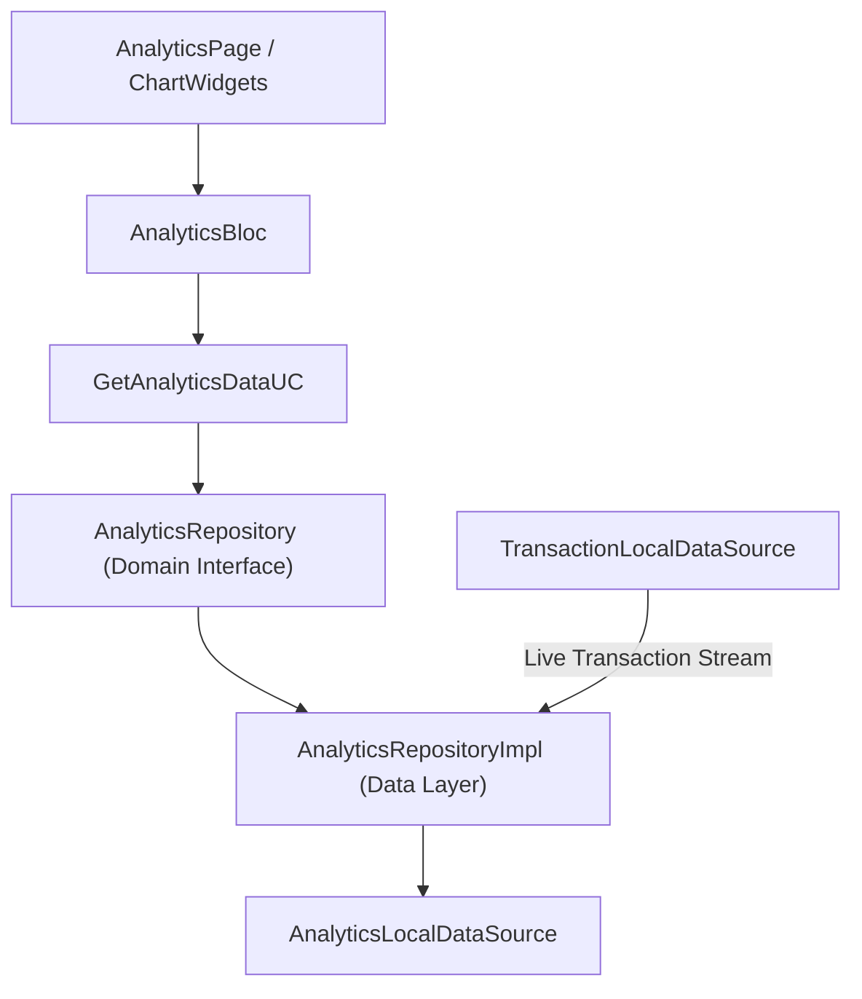

# Implementation Plan: Phase 7 – Analytics

This document details the technical architecture, data models, domain use cases, state management (BLoC), interactive chart widgets, and real-time transaction sync for implementing **Phase 7 (Analytics)** in **Dhanra-New**.

---

## Objective & Key Features

Deliver a production-grade, interactive **Financial Analytics System**:
1. 📈 **Income vs Expense Comparison Chart**:
   - Bar/Column chart comparing total Income vs Expense across Weekly, Monthly, or Custom periods.
2. 🍩 **Category Spending Breakdown Donut Chart**:
   - Visual category distribution (e.g. *Shopping 45%*, *Groceries 25%*, *Food 15%*) with custom category color badges.
3. 📉 **Cash Flow & Balance Trajectory Line Chart**:
   - Cumulative net cash flow trajectory over time.
4. 🗓️ **Time Period Range Filtering**:
   - `Weekly` (This Week)
   - `Monthly` (This Month)
   - `Custom Date Range` (Start Date – End Date selector)
5. 📊 **Key Metrics Summary Grid**:
   - Total Income (+₹), Total Expense (-₹), Net Cash Flow (₹), Average Daily Spend (₹), and Top Expense Category.
6. 🔄 **Reactive Transaction Sync**:
   - `AnalyticsRepositoryImpl` listens to `TransactionLocalDataSource` to auto-calculate all charts and statistics in real time as transactions are added/edited/deleted!

---

## Architecture Diagram

---

## Proposed Module Structure

### Analytics Feature (`lib/features/analytics`)

#### Domain Layer
- `lib/features/analytics/domain/entities/category_spending_entity.dart`
- `lib/features/analytics/domain/entities/monthly_trend_entity.dart`
- `lib/features/analytics/domain/entities/analytics_data_entity.dart`
- `lib/features/analytics/domain/repositories/analytics_repository.dart`
- `lib/features/analytics/domain/usecases/get_analytics_data_usecase.dart`

#### Data Layer
- `lib/features/analytics/data/datasources/analytics_local_data_source.dart`
- `lib/features/analytics/data/repositories/analytics_repository_impl.dart`

#### Presentation Layer (BLoC & UI)
- `lib/features/analytics/presentation/bloc/analytics_event.dart`
- `lib/features/analytics/presentation/bloc/analytics_state.dart`
- `lib/features/analytics/presentation/bloc/analytics_bloc.dart`
- `lib/features/analytics/presentation/widgets/analytics_metrics_grid.dart`
- `lib/features/analytics/presentation/widgets/income_vs_expense_chart_card.dart`
- `lib/features/analytics/presentation/widgets/category_breakdown_chart_card.dart`
- `lib/features/analytics/presentation/widgets/cash_flow_trend_card.dart`
- `lib/features/analytics/presentation/pages/analytics_page.dart`
