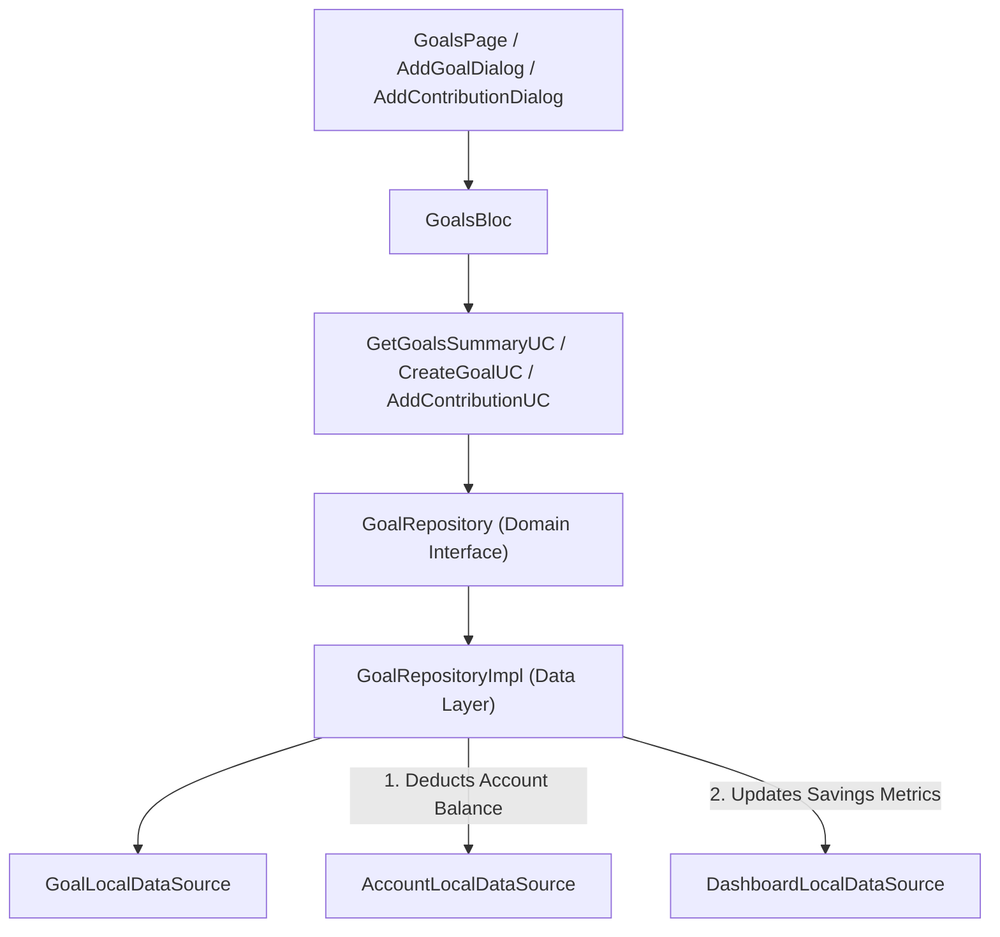

# Implementation Plan: Phase 8 – Savings Goals Management

This document details the technical architecture, data models, domain use cases, state management (BLoC), UI components, contribution logging, and real-time account/dashboard sync for implementing **Phase 8 (Goals)** in **Dhanra-New**.

---

## Objective & Key Features

Deliver a production-grade **Savings Goal Management System**:
1. 🎯 **Savings Goals Tracking**:
   - Create, edit, and track goal milestones (e.g. *Emergency Fund*, *New Mac Studio*, *Japan Trip*).
   - Target amount vs current saved amount, progress percentage (% saved), and target deadline.
2. 💡 **Dynamic Monthly Savings Suggestion**:
   - Computes suggested monthly deposit: `(targetAmount - currentAmount) / remainingMonthsToDeadline`.
3. 💵 **Goal Contributions & Account Transfer Sync**:
   - Add deposit contributions directly to a goal.
   - Automatically deducts contribution amount from the selected source account (`AccountLocalDataSource`) and updates Home Dashboard savings metrics in real time!
4. 🎉 **Goal Completion Celebration**:
   - Automatically marks goals as `Completed 🎉` when progress reaches 100%.
5. 📱 **Screen & Router Integration**:
   - `GoalsPage` accessible via `/goals` (`AppRoutes.goals`) and from Settings (`SettingsPage`).

---

## Architecture Diagram

---

## Proposed Module Structure

### Goals Feature (`lib/features/goals`)

#### Domain Layer
- `lib/features/goals/domain/entities/goal_entity.dart`
- `lib/features/goals/domain/entities/goal_contribution_entity.dart`
- `lib/features/goals/domain/entities/goals_summary_entity.dart`
- `lib/features/goals/domain/repositories/goal_repository.dart`
- `lib/features/goals/domain/usecases/get_goals_summary_usecase.dart`
- `lib/features/goals/domain/usecases/create_goal_usecase.dart`
- `lib/features/goals/domain/usecases/update_goal_usecase.dart`
- `lib/features/goals/domain/usecases/delete_goal_usecase.dart`
- `lib/features/goals/domain/usecases/add_goal_contribution_usecase.dart`

#### Data Layer
- `lib/features/goals/data/models/goal_model.dart`
- `lib/features/goals/data/models/goal_contribution_model.dart`
- `lib/features/goals/data/datasources/goal_local_data_source.dart`
- `lib/features/goals/data/repositories/goal_repository_impl.dart`

#### Presentation Layer (BLoC & UI)
- `lib/features/goals/presentation/bloc/goals_event.dart`
- `lib/features/goals/presentation/bloc/goals_state.dart`
- `lib/features/goals/presentation/bloc/goals_bloc.dart`
- `lib/features/goals/presentation/widgets/goals_summary_hero_card.dart`
- `lib/features/goals/presentation/widgets/goal_card.dart`
- `lib/features/goals/presentation/widgets/add_edit_goal_dialog.dart`
- `lib/features/goals/presentation/widgets/add_contribution_dialog.dart`
- `lib/features/goals/presentation/pages/goals_page.dart`
