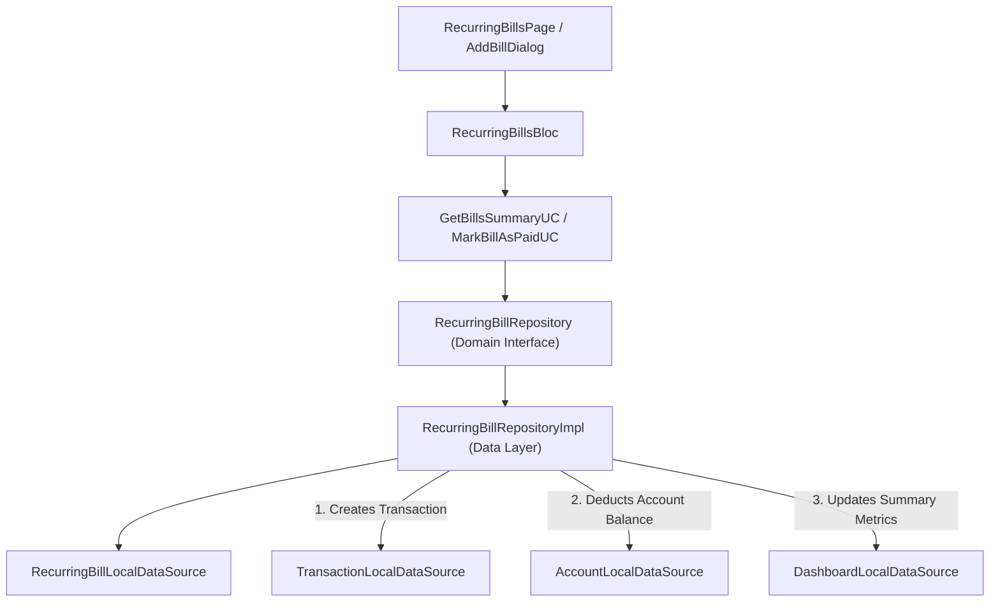

# Implementation Plan: Phase 9 – Bills & Recurring Transactions

This document details the technical architecture, data models, domain use cases, state management (BLoC), UI components, payment quick actions, auto-transaction logging, and real-time account/dashboard sync for implementing **Phase 9 (Bills & Recurring Transactions)** in **Dhanra-New**.

---

## Objective & Key Features

Deliver a production-grade **Bills & Recurring Transaction Management System**:
1. 🔄 **Recurring Expenses, EMIs & Subscriptions Tracking**:
   - Manage recurring expenses (e.g. *House Rent*, *Electricity Bill*, *Car Loan EMI*, *Netflix Subscription*) and recurring income (e.g. *Monthly Salary*).
   - Frequency options: `Daily`, `Weekly`, `Monthly`, `Quarterly`, `Yearly`.
2. 🗓️ **Due Date Tracking & Overdue Warnings**:
   - Next payment due date, status badges (`Upcoming`, `Paid ✅`, `Overdue ⚠️`).
3. 💳 **"Pay Now" Quick Payment & Real-Time Sync**:
   - Marking a bill as paid automatically creates a live transaction entry in Phase 5 (`TransactionLocalDataSource`).
   - Automatically deducts the payment amount from the selected source Account (`AccountLocalDataSource`) and updates Home Dashboard metrics in real time!
4. 📱 **Screen & Router Integration**:
   - `RecurringBillsPage` accessible via `/recurring-bills` (`AppRoutes.recurringBills`) and from Settings (`SettingsPage`).

---

## Architecture Diagram

---

## Proposed Module Structure

### Recurring Bills Feature (`lib/features/recurring_bills`)

#### Domain Layer
- `lib/features/recurring_bills/domain/entities/recurring_bill_entity.dart`
- `lib/features/recurring_bills/domain/entities/recurring_bills_summary_entity.dart`
- `lib/features/recurring_bills/domain/repositories/recurring_bill_repository.dart`
- `lib/features/recurring_bills/domain/usecases/get_recurring_bills_summary_usecase.dart`
- `lib/features/recurring_bills/domain/usecases/create_recurring_bill_usecase.dart`
- `lib/features/recurring_bills/domain/usecases/update_recurring_bill_usecase.dart`
- `lib/features/recurring_bills/domain/usecases/delete_recurring_bill_usecase.dart`
- `lib/features/recurring_bills/domain/usecases/mark_recurring_bill_as_paid_usecase.dart`

#### Data Layer
- `lib/features/recurring_bills/data/models/recurring_bill_model.dart`
- `lib/features/recurring_bills/data/datasources/recurring_bill_local_data_source.dart`
- `lib/features/recurring_bills/data/repositories/recurring_bill_repository_impl.dart`

#### Presentation Layer (BLoC & UI)
- `lib/features/recurring_bills/presentation/bloc/recurring_bills_event.dart`
- `lib/features/recurring_bills/presentation/bloc/recurring_bills_state.dart`
- `lib/features/recurring_bills/presentation/bloc/recurring_bills_bloc.dart`
- `lib/features/recurring_bills/presentation/widgets/recurring_bills_summary_card.dart`
- `lib/features/recurring_bills/presentation/widgets/recurring_bill_tile.dart`
- `lib/features/recurring_bills/presentation/widgets/add_edit_recurring_bill_dialog.dart`
- `lib/features/recurring_bills/presentation/pages/recurring_bills_page.dart`
